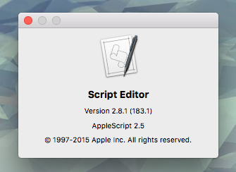

# Check AppleScript version

While trying to figure out what version of AppleScript I had installed, I came across [this article][2001_article]. The problem? That article is from 2001 and the script no longer works! The script provided in that article will *always* return version 1.0 as your version, because it now checks the version of the *currently executing script* (implicitly set to 1.0) rather than AppleScript itself.

There are a couple ways to get the actual AppleScript version.

## Check via script

You can find the current version of AppleScript via this script (also this [gist](https://gist.github.com/SnoringFrog/c29c3180dcd92bd571b6)):

```AppleScript
display dialog "You're running AppleScript " & version of AppleScript
```

[Source]
[Source]:https://developer.apple.com/library/mac/documentation/AppleScript/Conceptual/AppleScriptLangGuide/conceptual/ASLR_fundamentals.html#//apple_ref/doc/uid/TP40000983-CH218-DontLinkElementID_347
## Check via Script Editor

Additionally, you can open `Script Editor` and in the menubar go to `Script Editor -> About Script Editor`. The current AppleScript version will be displayed below the `Script Editor` version number.



[Source]
[Source]:http://apple.stackexchange.com/a/225221/61338

[2001_article]:https://www.safaribooksonline.com/library/view/applescript-in-a/1565928415/ch01s05.html

